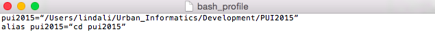
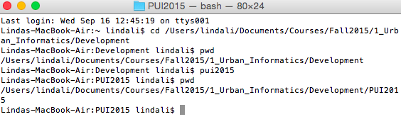

# PUI2015_lli
Steps taken to set up environment:
1) Created new directory on local machine
2) Created new repository on github account
3) Created new repository on the command line
4) Set environmental variable and alias for this local directory

